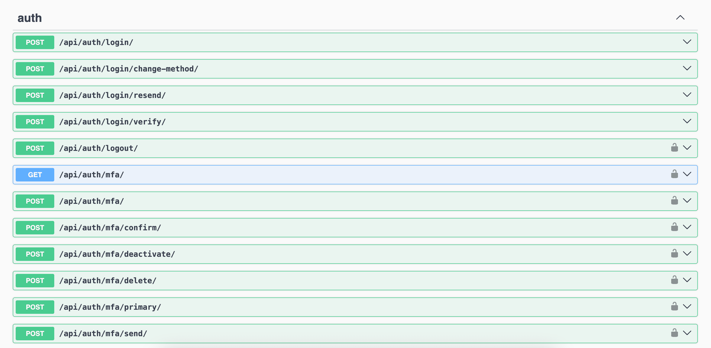
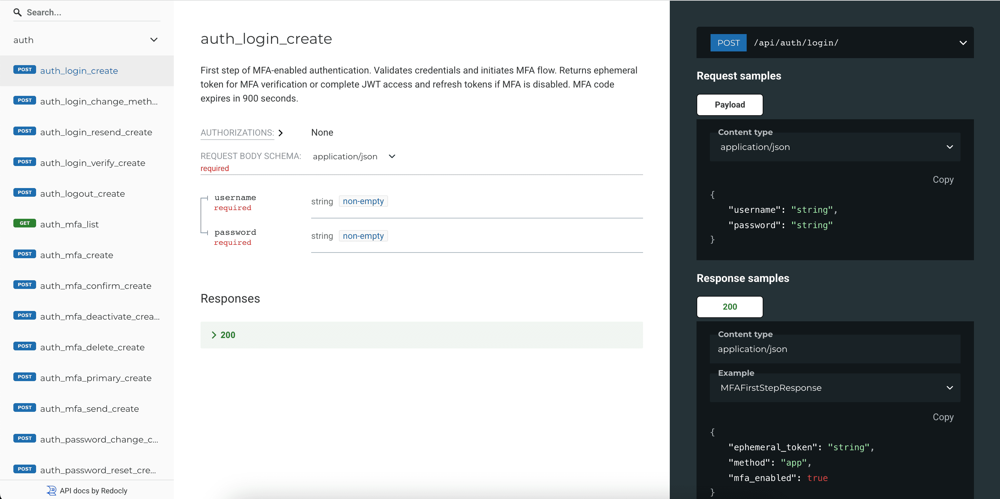
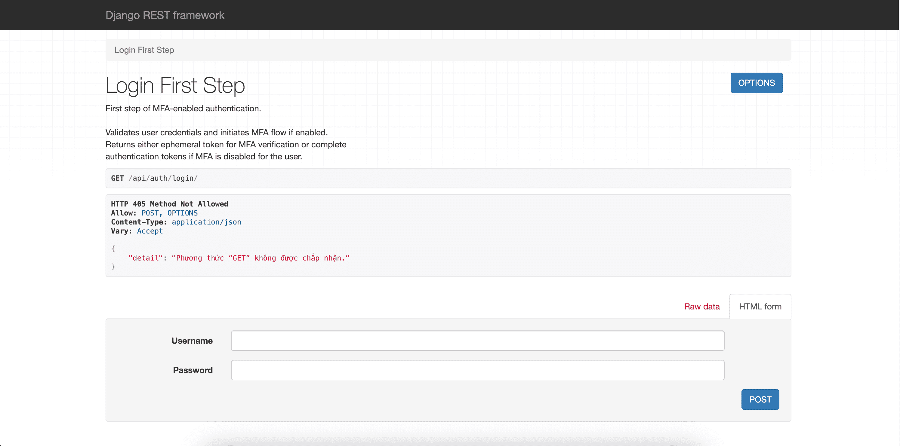
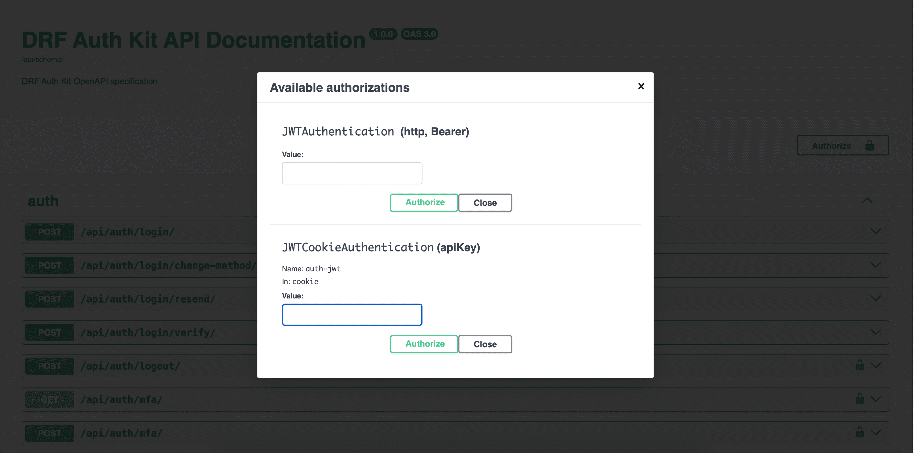

API Documentation Setup
=======================

This guide covers how to set up interactive API documentation for testing DRF Auth Kit endpoints. This setup is referenced by other user guides as a prerequisite.

Overview
--------

DRF Auth Kit automatically generates comprehensive API documentation. Instead of using command-line tools, you can explore and test the authentication endpoints directly in your browser using:

- **Swagger UI** - Interactive API explorer with request/response examples
- **ReDoc** - Clean, detailed API documentation
- **DRF Browsable API** - HTML forms for testing endpoints

Setting Up API Documentation
-----------------------------

**Install DRF Spectacular (if not already installed)**

.. code-block:: bash

    pip install drf-spectacular

**Configure Django Settings**

.. code-block:: python

    # settings.py
    INSTALLED_APPS = [
        # ... your existing apps
        'drf_spectacular',
    ]

    REST_FRAMEWORK = {
        'DEFAULT_SCHEMA_CLASS': 'drf_spectacular.openapi.AutoSchema',
        # ... your other REST_FRAMEWORK settings
    }

**Add URL Patterns**

.. code-block:: python

    # urls.py
    from drf_spectacular.views import SpectacularAPIView, SpectacularSwaggerView, SpectacularRedocView

    urlpatterns = [
        path('api/schema/', SpectacularAPIView.as_view(), name='schema'),
        path('api/docs/', SpectacularSwaggerView.as_view(url_name='schema'), name='swagger-ui'),
        path('api/redoc/', SpectacularRedocView.as_view(url_name='schema'), name='redoc'),
        # ... your other URLs including auth_kit URLs
    ]

Enable Browsable API (Development Only)
----------------------------------------

To use DRF's browsable API for testing endpoints, add the renderer to your settings:

.. code-block:: python

    # settings.py (development only)
    REST_FRAMEWORK = {
        'DEFAULT_RENDERER_CLASSES': [
            'rest_framework.renderers.JSONRenderer',
            'rest_framework.renderers.BrowsableAPIRenderer',  # For development
        ],
        'DEFAULT_AUTHENTICATION_CLASSES': [
            'auth_kit.authentication.JWTCookieAuthentication',
        ],
        'DEFAULT_SCHEMA_CLASS': 'drf_spectacular.openapi.AutoSchema',
        # ... your other settings
    }

**Security Warning**: Only include ``BrowsableAPIRenderer`` in development. Remove it in production for security and performance.

Available Documentation Endpoints
----------------------------------

Once configured, you can access:

**Swagger UI**: ``/api/docs/``
    Interactive API explorer with request/response examples. Best for testing individual endpoints.

**ReDoc**: ``/api/redoc/``
    Clean, detailed API documentation. Best for understanding the complete API structure.

**OpenAPI Schema**: ``/api/schema/``
    Raw OpenAPI schema in JSON format. Useful for generating client code.

**Browsable API**: Visit any endpoint directly
    HTML forms for testing endpoints (e.g., ``/api/auth/registration/``). Requires authentication for protected endpoints.

Testing Authenticated Endpoints
--------------------------------

**Using Swagger UI**

*With Cookie Authentication (default):*

1. Login via ``POST /api/auth/login/``
2. Authentication cookies are automatically set in your browser
3. Test protected endpoints like ``GET /api/auth/user/`` - no manual token setup needed
4. Tokens are automatically included in subsequent requests

*With Header Authentication:*

1. Login via ``POST /api/auth/login/``
2. Copy the access token from the response
3. Click "Authorize" in Swagger UI
4. Enter ``Bearer <your-access-token>`` in the authorization field
5. Test protected endpoints like ``GET /api/auth/user/``

**Using Browsable API**

*With Cookie Authentication (default):*

1. Login via ``POST /api/auth/login/``
2. Authentication cookies are automatically set in your browser
3. Navigate to protected endpoints directly in your browser
4. Use the HTML forms to make requests - authentication is automatic

*With Header Authentication:*

1. Login via ``POST /api/auth/login/``
2. You'll need to manually include the ``Authorization`` header in requests
3. The browsable API may require additional setup for header-based auth testing

**Understanding Authentication States**

*Unauthenticated Requests:*
- Return 401 Unauthorized for protected endpoints
- Public endpoints (registration, login, password reset) work normally

*Authenticated Requests:*
- Include valid tokens automatically (cookies) or manually (headers)
- Access to protected endpoints like user profile, logout
- Token refresh happens automatically with cookies

Next Steps
----------

After completing this setup:

- **Basic Authentication**: :doc:`basic-usage` - Learn core authentication features
- **Social Authentication**: :doc:`social-authentication` - Set up social login
- **Multi-Factor Authentication**: :doc:`mfa` - Enable additional security
- **Customization**: :doc:`customization` - Customize authentication behavior

Development Tips
----------------

- Use the browsable API during development for quick testing
- Set up API documentation early for better team collaboration
- Test both success and error scenarios using the interactive documentation
- Consider your authentication method (cookies vs headers) based on your frontend architecture
